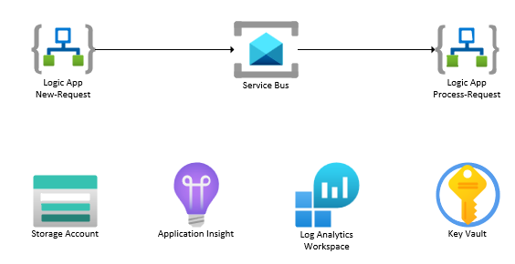
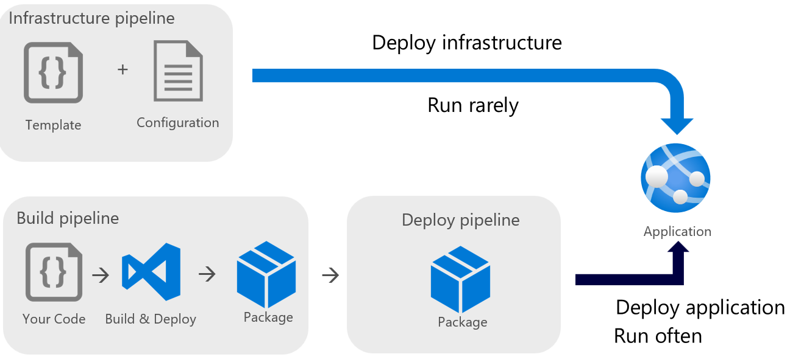

# logic-sb-integration

This repo shows how to deploy a Logic App (Standard) using Bicep & Azure DevOps pipelines. It uses the new Logic Apps (Standard) project template. The 1st Logic App is triggered via HTTP and puts a message on the Service Bus. The 2nd Logic App takes the message off the Service Bus and sends an email with the Office 365 connector.

This repo recommends creating 3 pipelines (deploy infrastructure, build Logic App & Deploy Logic App).

## Disclaimer

**THE SOFTWARE IS PROVIDED "AS IS", WITHOUT WARRANTY OF ANY KIND, EXPRESS OR IMPLIED, INCLUDING BUT NOT LIMITED TO THE WARRANTIES OF MERCHANTABILITY, FITNESS FOR A PARTICULAR PURPOSE AND NONINFRINGEMENT. IN NO EVENT SHALL THE AUTHORS OR COPYRIGHT HOLDERS BE LIABLE FOR ANY CLAIM, DAMAGES OR OTHER LIABILITY, WHETHER IN AN ACTION OF CONTRACT, TORT OR OTHERWISE, ARISING FROM, OUT OF OR IN CONNECTION WITH THE SOFTWARE OR THE USE OR OTHER DEALINGS IN THE SOFTWARE.**

## Prerequisites

- [Azure CLI](https://docs.microsoft.com/en-us/cli/azure/install-azure-cli)
- Azure subscription & resource group
- [VS Code Extension for Logic Apps Standard](https://marketplace.visualstudio.com/items?itemName=ms-azuretools.vscode-azurelogicapps)

## Deployment

1.  Create an Azure DevOps `Dev` environment.

1.  Set up 3 Azure DevOps YAML pipelines using the following YAML files:

    - [Deploy Infrastructure](ado/bicep/infra/pipeline.yml)
    - [Build Logic App](ado/logic-app/build/pipeline.yml)
    - [Deploy Logic App](ado/logic-app/deploy/pipeline-bicep.yml)

1.  Execute the pipelines in the same order.

## Links

- [Logic Apps](https://learn.microsoft.com/en-us/azure/logic-apps/logic-apps-overview)
- [Logic Apps (Standard)](https://learn.microsoft.com/en-us/azure/logic-apps/single-tenant-overview-compare)
- [Logic Apps (Standard) project template](https://learn.microsoft.com/en-us/azure/logic-apps/create-single-tenant-workflows-azure-portal)
- [Logic Apps deployment](https://learn.microsoft.com/en-us/azure/logic-apps/logic-apps-azure-resource-manager-templates-overview)
